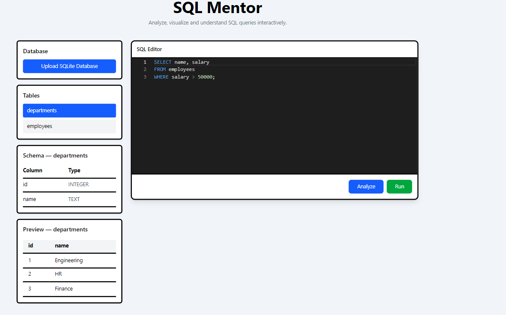
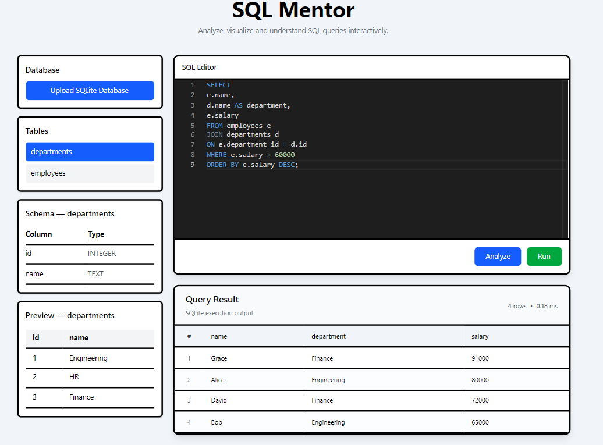
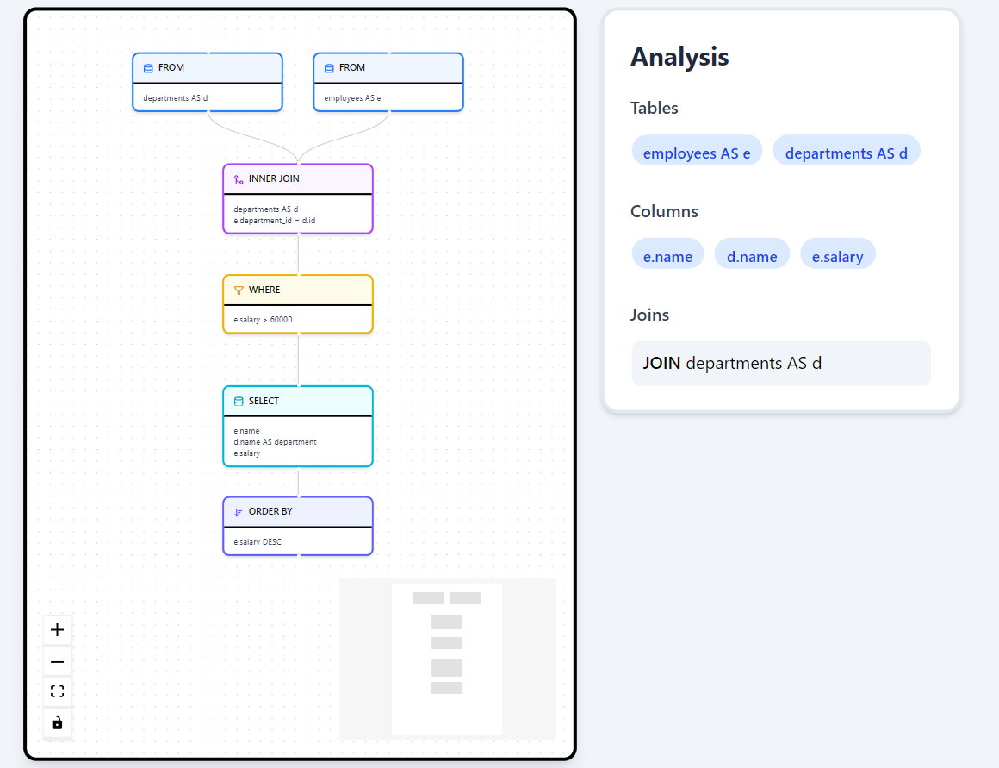
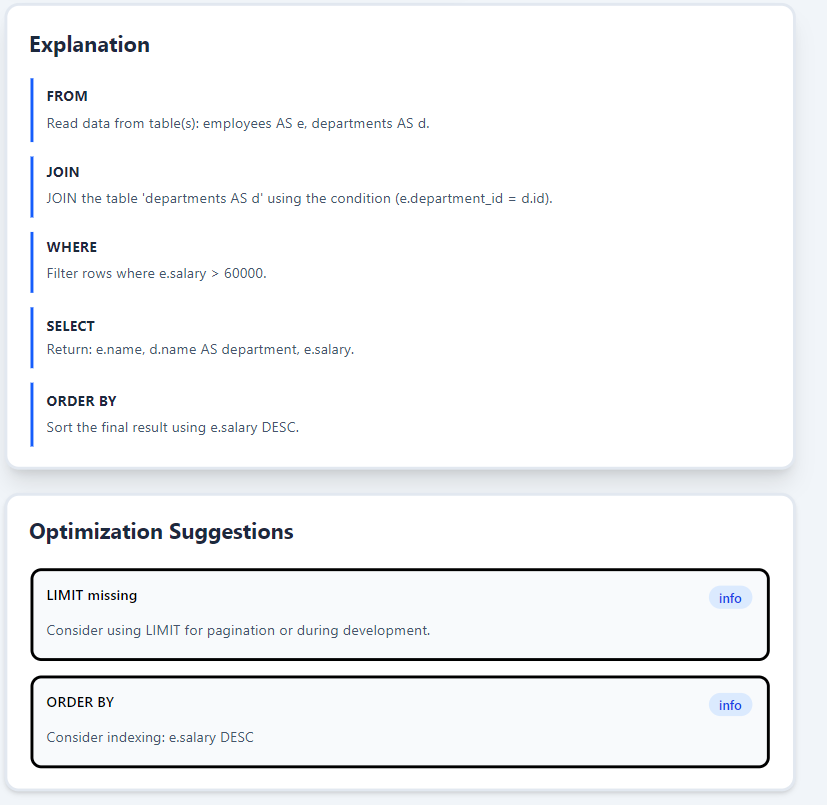
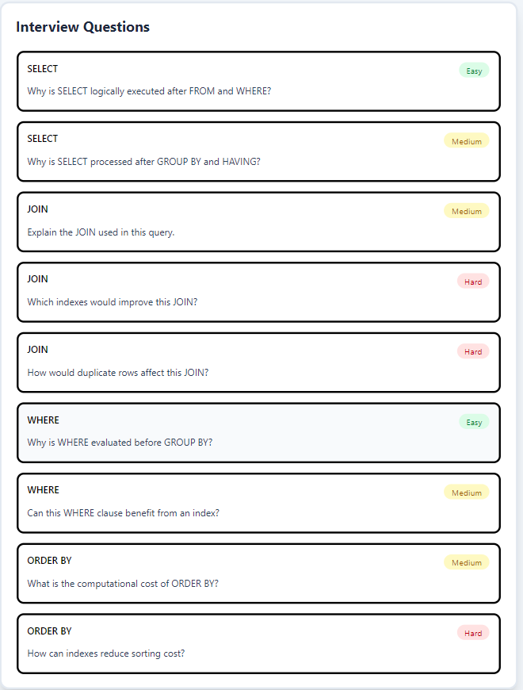

# SQL Explainer

<p align="center">

An interactive SQL learning platform that helps users understand **how SQL queries are executed internally** through execution graphs, query analysis, explanations, optimization suggestions, and interview questions.

Built for students, interview preparation, and database education.

</p>

---

## Features

- Interactive SQL Editor
- Execution Graph Visualization
- Query Analysis
- Step-by-Step SQL Execution
- SQL Explanation Generator
- Query Optimization Suggestions
- SQL Interview Questions
- Supports
  - SELECT
  - WHERE
  - JOIN
  - GROUP BY
  - HAVING
  - ORDER BY
  - LIMIT
  - Aggregate Functions
- Modern React UI
- FastAPI Backend

---

## Screenshots

### Home



---

### SQL Query and its output



---

### Execution Graph + Query Analysis



---

### Explanation



---

### Interview Questions



---

# Architecture

```
            SQL Query
                 │
                 ▼
        SQL Parser (sqlglot)
                 │
                 ▼
         Query Analysis Engine
                 │
        ┌────────┼────────┐
        ▼        ▼        ▼
 Execution   Explanation  Optimization
  Graph          │             │
        └────────┼────────┘
                 ▼
              Frontend
```

---

# Tech Stack

### Frontend

- React
- TypeScript
- Tailwind CSS
- React Flow
- Framer Motion
- Lucide Icons

### Backend

- FastAPI
- sqlglot
- Python

---

# Folder Structure

```
frontend/
backend/

backend/app/
    analyzer/
    parser/
    graph/
    api/

frontend/src/
    components/
    graph/
    pages/
    services/
```

---

# Installation

## Clone Repository

```bash
git clone https://github.com/MananJain-dev/SQL-Explainer.git
cd SQL-Explainer
```

---

## Backend

```bash
cd backend

python -m venv venv

source venv/bin/activate
```

Windows

```bash
venv\Scripts\activate
```

Install dependencies

```bash
pip install -r requirements.txt
```

Run

```bash
uvicorn app.main:app --reload
```

---

## Frontend

```bash
cd frontend

npm install

npm run dev
```

---

# Example Query

```sql
SELECT
    d.name,
    COUNT(e.id),
    AVG(e.salary)
FROM employees e
JOIN departments d
ON e.department_id = d.id
WHERE e.salary > 50000
GROUP BY d.name
HAVING COUNT(e.id) >= 2
ORDER BY AVG(e.salary) DESC
LIMIT 5;
```

---

# What SQL Explainer Shows

✔ Query Analysis

✔ Execution Graph

✔ Logical SQL Execution Order

✔ Optimization Suggestions

✔ SQL Interview Questions

---

# Roadmap

- Window Function Support
- Common Table Expressions
- Recursive CTEs
- Subquery Visualization
- Execution Timeline Animation
- PostgreSQL Planner Integration
- Cost Estimation

---

# Why SQL Explainer?

SQL Explainer focuses on **understanding SQL**, not just executing it.

It visualizes the logical execution pipeline of SQL queries and explains how clauses interact, helping learners build an intuition for relational query processing.

---

# Contributing

Contributions are welcome.

1. Fork the repository

2. Create a feature branch

```
git checkout -b feature/new-feature
```

3. Commit

```
git commit -m "Add feature"
```

4. Push

```
git push origin feature/new-feature
```

5. Open a Pull Request

---

# License

This project is licensed under the MIT License.

See the LICENSE file for details.

---

# Author

**Manan Jain**

B.Tech Computer Science Engineering

IIT Jammu

GitHub:
https://github.com/MananJain-dev

---

If you found this project helpful, consider giving it a ⭐.
